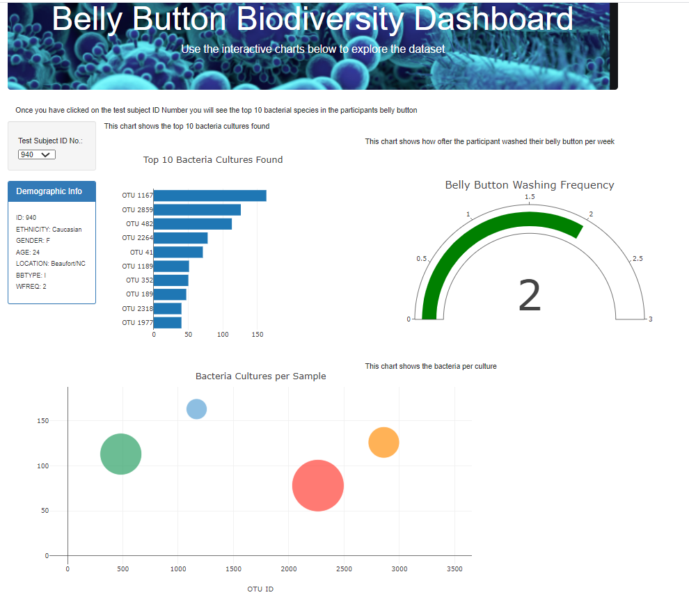

The purpose of this repository is for each participant to go into a site, allow the participant to choose their ID # from the dropdown, and identify the top 10 bacterial species in their belly buttons.
The site is meant to be an interactive place, that will display charts for a summary of data for each ID number.

